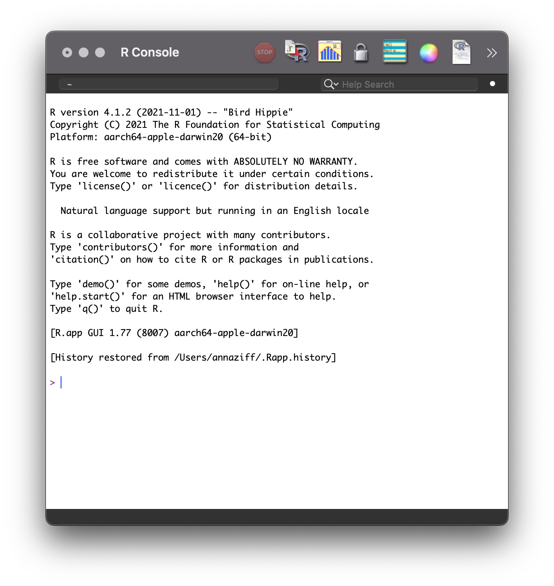
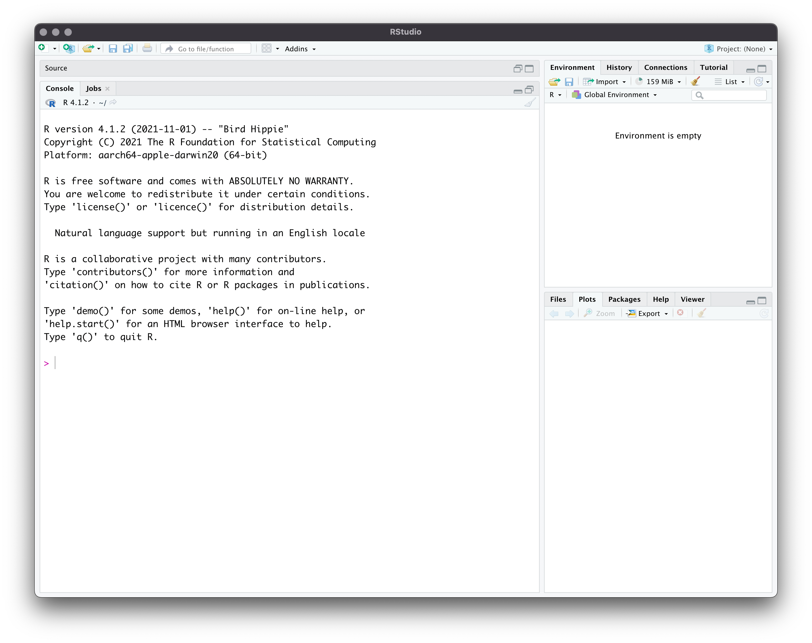
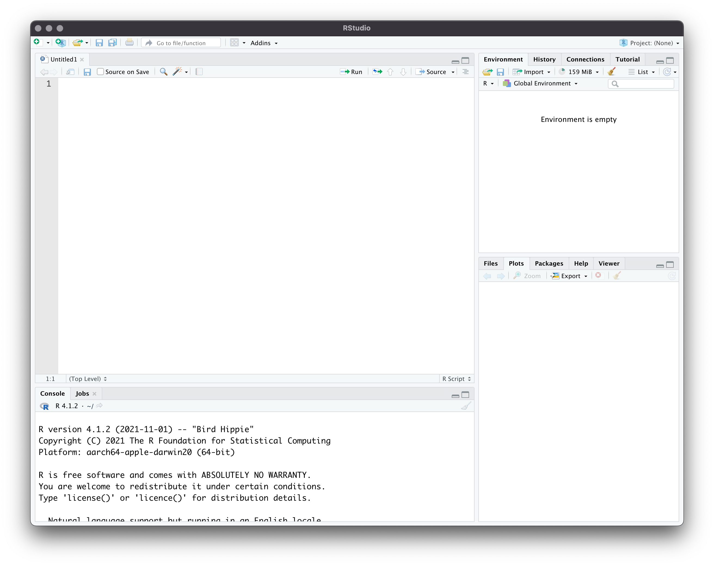
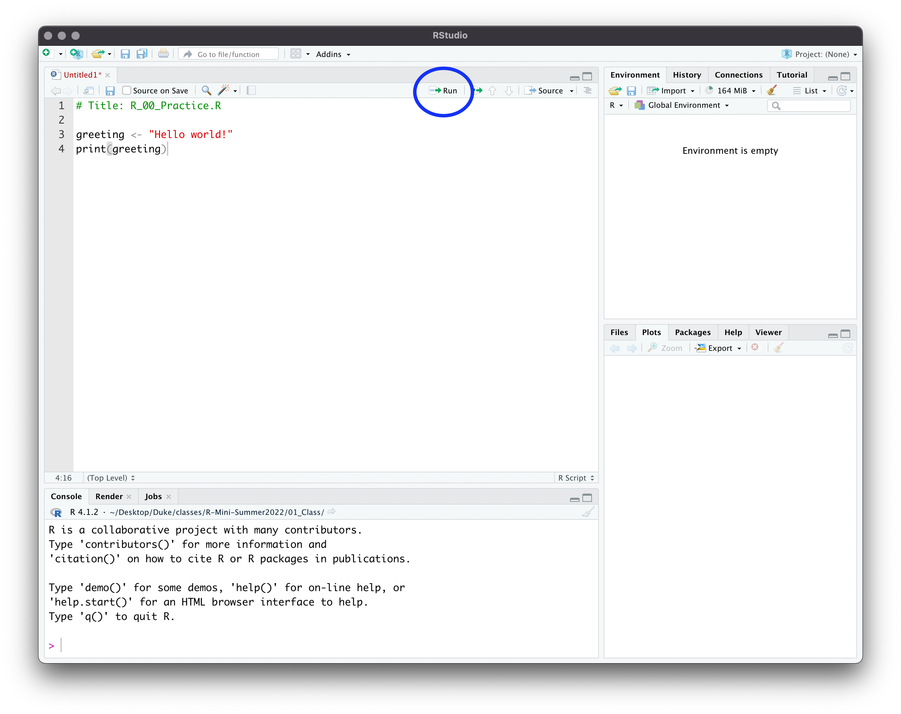

\tableofcontents
\clearpage

# About R

R is a programming language and work environment for data analysis. R is especially well-suited for data work and graphics, although it provides the base for many types of analyses. It is widely used in economics across sectors. The benefits of R are as follows.

\begin{itemize}
  \item Free. Self-explanatory.
  \item Open source. Any user can develop functions and packages. These packages are freely available, resulting in the constant expansion and improvement of R and its capabilities.
  \item Flexible. R incorporates many of the strengths of the alternatives. It can be used to clean, analyze, and visualize data. With the aid of packages, it can also be used for optimization, web scrapping, network analysis, text analysis, machine learning, and many other tasks.
  \item Fast. R is designed for efficiency, especially for certain data structures. Even a novice user can write very efficient code.
  \item Relatively simple. Even though R has a steeper learning curve than STATA, it is much more straightforward than C. 
\end{itemize}

Despite these benefits, there are a few downsides that any user must consider.
\begin{itemize}
  \item Difficulty. Is the user committed to learning how to use R to maximize its benefits? Often, code needs to be read by those other than the author. Are these other individuals equipped to understand R syntax and semantics?\footnote{The syntax of programming languages comprises the symbols, words, and structure of the code. The semantics of programming languages comprise the meaning behind the symbols, words, and structure.}
  \item Errors. The user-written packages are heterogeneous in quality. Some may have poor documentation or even mistakes. Sometimes, authors do not update their code or respond to error reports, resulting in commands that do not work for more recent versions of R.
\end{itemize}

# Installation

## R

\begin{enumerate}
  \item R is available for free from the {\color{blue}{\href{https://cran.r-project.org/}{Comprehensive R Archive Network (CRAN)}}}. Go to this website.
  \item Click the download link that corresponds to your operating system.
  \begin{itemize}
    \item Mac. Select the version that corresponds with the version of your operating system. Follow the installation instructions.
    \item Windows. Click ``Base'' and download the installer. Follow the installation instructions.
    \item Linux. Click on your distribution. Follow the installation instructions.
  \end{itemize}
\end{enumerate}

Confirm that installation was successful by opening the R program. When you open R, you will see a console that looks like Figure 1, or at least very similar. Every time you open R, a new session begins. At the start of each session, the console prints some information, like the version of R and some basic help commands. The line with \texttt{>} is the command line. This is where you can type commands. Try typing \texttt{print("Hello world!")} and press \texttt{Enter} or \texttt{Return}.

```{r echo = FALSE, fig.cap = "R Console", fig.align = "center", out.width = "40%"} 

```


## RStudio

While the R application is perfectly functional on its own, it is not as convenient as other applications. Specifically, we are interested in a more user-friendly Graphical User Interface (GUI). The GUI comprises the menus available to users for point-and-click operations. RStudio is a free software with an accessible GUI. 

\begin{enumerate}
  \item Navigate to the {\color{blue}{\href{https://www.rstudio.com/products/rstudio/download/}{RStudio IDE webpage}}}.
  \item Choose the free version of RStudio Desktop.
  \item Select your operating system and follow the installation instructions.
\end{enumerate}

Confirm that the installation was successful by opening RStudio. The workspace should look very similar to Figure 2. 

# Using RStudio

There are three segments of the initial RStudio workspace: the console (left segment), which is the same as the basic R console, the workspace environment (upper right segment), and miscellaneous displays (lower right segment). 

```{r echo = FALSE, fig.cap = "RStudio Opening Console", fig.align = "center", out.width = "80%"} 

```

There is one more segment that is crucial: the script editor. Although you can type commands directly into the console, it is much easier and better practice to execute code from scripts. To open the script editor with an empty file, click \texttt{File > New File > R Script}. The file extension is \texttt{.R}. With all four segments of the RStudio workspace open (Figure 3), we can now go through each one in detail. 

```{r echo = FALSE, fig.cap = "RStudio Full Workspace", fig.align = "center", out.width = "80%"} 

```

## Console
Just like in the R application, you can type commands here directly at the angle bracket, \texttt{>}. Try typing \texttt{print("Hello world!")}. The output is printed in the same window. If you quit RStudio and reopen it, the commands you typed in the console will not be saved. For this reason, the console should be used to print output and test commands, not to write your entire analysis. 

## Script Editor
The script editor is where you can write, edit, and save your code. The code can be executed with the output printed to the console. In your blank R script, type the following lines.

```{r eval = FALSE}
# Title: R_00_Practice.R

greeting <- "Hello world!"
print(greeting)
```

Execute the code by highlighting all lines. Then click \texttt{Run}, circled in Figure 4.

```{r echo = FALSE, fig.cap = "RStudio Run Button", fig.align = "center", out.width = "80%"} 

```


## Workspace
Once you run your code, you will see a change in the workspace environment. Any object, structure, or function that is created in your code will be listed there. To remove an object, structure, or function, use the command \texttt{rm()}. It is good practice to clear the workspace before any code is executed. Add \texttt{rm(list = ls())} to the top of your code to clear everything from the workspace. Note that the command \texttt{ls()} lists all of the contents of the workspace.

```{r eval = FALSE}
# Title: R_00_Practice.R

rm(list = ls())

greeting <- "Hello world!"
print(greeting)
```

The \texttt{History} tab keeps track of recently used commands. The \texttt{Connections} tab is useful for SQL integration (outside the scope of this class). The \texttt{Tutorial} tab has instructions to access some tutorials.

## Miscellaneous Displays
The lower right segment contains several miscellaneous displays, each of which are useful for different steps of the R workflow.

### Files
The first display, \texttt{Files}, lists the folders of your computer. Clicking on the folders allows you to explore the file structure of your computer. Navigate to the folder in which you will save your code. At the top of the segment, you can see the file path to get there. This is useful when you need to change your working directory. In the console, experiment with the commands \texttt{getwd()} to print the current directory and \texttt{setwd()} to navigate the console to the \texttt{Practice-Exercises} directory. Add this to your R script. You will have a different filepath in the below code than the generic one.

```{r eval = FALSE}
# Title: R_00_Practice.R

rm(list = ls())
setwd("path/to/file")

greeting <- "Hello world!"
print(greeting)
```

Save the file with the name \texttt{R\_00\_Practice.R} to your current directory. This is done by clicking \texttt{File > Save}.

### Plots
The \texttt{Plots} window is useful when you are creating graphs, as they show up directly. The graphics demo, typed directly into the console, showcases some examples of R's graphing capabilities.

```{r eval = FALSE}
demo(graphics)
```

### Packages
The \texttt{Packages} tab displays all the external libraries on your computer. R is open source, meaning that anyone can publish functions to expand upon what is available for R users. The shareable code and documentation is called a package or library. The advantage of packages is that there may already be an implementation of a problem you aim to solve. For example, if you want to implement a method from an econometrics paper, a package for that method may already exist. If the package is well done, it may be more efficient and accurate than your own implementation. 

The Comprehensive R Archive Network (CRAN) is the official repository of R packages. Most of the packages you use will be published on CRAN. The function to install a package is \texttt{install.packages()}. Here is an example of how to install a package.

```{r eval = FALSE}
install.packages("ggplot2")
```

Once you install a package, the code and documentation are stored on your computer. You do not need to re-install the package every R session unless you want to ensure you have the most updated version of it. However, the package does need to be loaded every R session.
```{r eval = FALSE}
library(ggplot2)
```

If you want to specify which package the function comes from, you can use two colons, \texttt{::}. Using this format allows you to skip loading the package, although the package does need to be installed. You may see published code or answers on Stack Exchange that use this format. Here is an example. Sometimes, packages are only available on GitHub or you will want to use a more recent version that the package authors have not yet published to CRAN. To install these packages from GitHub, we need to access the \texttt{install\_github()} function from the package \texttt{devtools}.

```{r eval = FALSE}
devtools::install_github("https://github.com/tidyverse/ggplot2")
```

It is common that different packages define functions that have the same name. If you call one of these functions, R will default to the package that was loaded later (type \texttt{search()} in the command line to see the order in which packages were loaded). To notify you of this issue, R throws a warning message upon loading the package. The message lists the objects that are masked and the packages with the conflict.
```{r eval = FALSE}
install.packages("dplyr")
```
```{r eval = TRUE}
library(dplyr)
```

The double colon, \texttt{::} can be used to solve this issue. If you want to use one of these functions, you can specify which package R should reference. This is not always necessary, but it can help avoid errors if R is referencing a different package than what you expect.
```{r eval = TRUE}
base::union(1:10, 7:12)
```

Generally, it is good practice to load the packages you will use at the top of your R script. Edit your R script to load \texttt{ggplot2}.
```{r eval = FALSE}
# Title: R_00_Practice.R

rm(list = ls())
setwd("~/Desktop/Duke/R/Assignments-aziff/Practice-Exercises")

library(ggplot2)

greeting <- "Hello world!"
print(greeting)
```

### Help
The \texttt{Help} tab displays the documentation for functions. In the console, type the following. 

```{r eval = FALSE}
help(print)
?print
```

You will see an explanation of the function, a description of the usage, a list of the arguments, other details, references, and examples. As you are learning, it is great practice to get accustomed to accessing the documentation of commands; and RStudio makes it easy! While you will need to search online for specific help and troubleshooting, the \texttt{?} command and the integrated \texttt{Help} window make the process of learning new commands as simple as possible. 

### Viewer
The \texttt{Viewer} tab is helpful when creating websites and applications that use R input and output (Shiny). This is outside the scope of the class.

# Practice Exercises 0
\begin{enumerate}
\item The top of the script has a commented line: \texttt{\# Title: R\_00\_Practice.R}. The \texttt{\#} signals to R not to execute the code. Add other lines to the header of your script for the author and date. 
\item Access the documentation for \texttt{mean()} from the console. Familiarize yourself with the structure of the help documentation. Take note of the following sections: Description, Usage, Arguments, Value, Examples. 
\item Several packages are combined in the collection \texttt{tidyverse}. These are all useful for data science, and we will be using functions from several of them in this class. Install this package. It takes a while!
\item The collection \texttt{tidyverse} contains \texttt{ggplot2}. Delete \texttt{library(ggplot2)} in \texttt{R\_00\_Practice.R} and load \texttt{tidyverse} instead.
\end{enumerate}

# Further Reading

\href{https://support.rstudio.com/hc/en-us/articles/200484448-Editing-and-Executing-Code}{This website} goes through the most important features of the script editor. If you have never used RStudio before, skim through these features. Test out the keyboard shortcut to execute code.

The information above primarily comes from chapters 2 and 3.2-3.4 of @boehmke_data_2016. 

## References