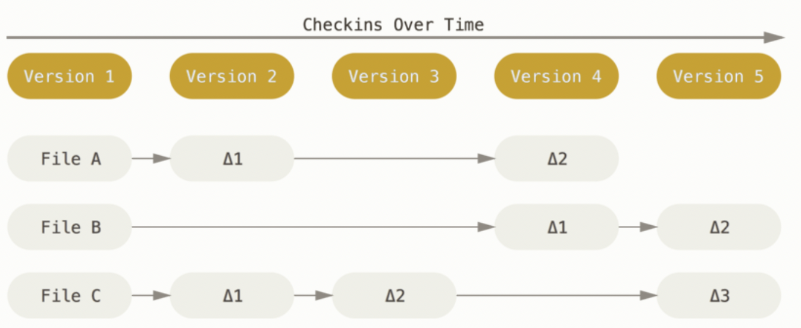
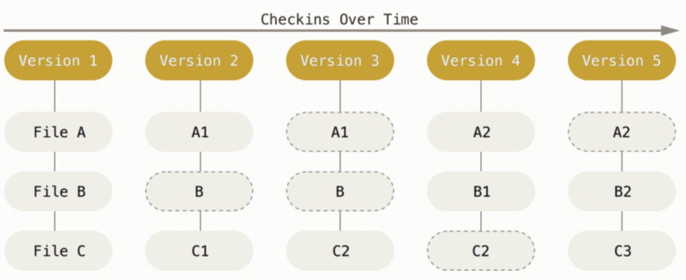
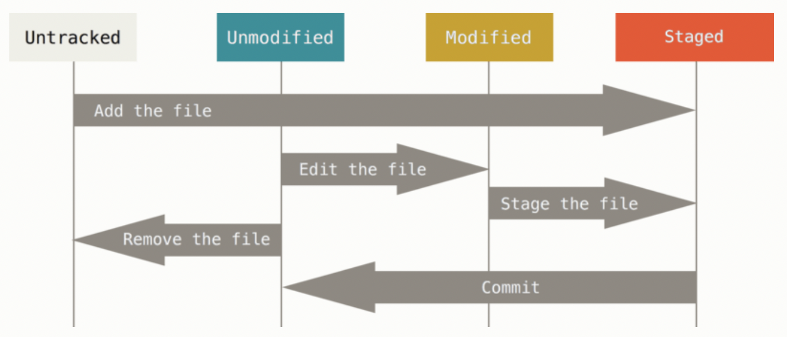

```{r libraries, echo = FALSE}
library(knitr)
```

\tableofcontents
\clearpage

# Command Line

The command line is a direct way to type instructions for your computer to immediately execute. Comfort with some basics can help you more easily use R, Git, and any other language or software.

* If you are a Windows user, open GitBash. There are other options, but practicing in GitBash (or your Git application of choice) will help you learn Git later on.
* If you are a Mac user, open Terminal.
* If you are Linux user, open Terminal or your system's shell application.

## Navigating Directories

Print the working directory with \texttt{pwd}.
```{bash, eval = FALSE}
pwd
```

List files in the current directory with \texttt{ls}. Sometimes there are hidden files (e.g., \texttt{.gitignore}). Add the \texttt{-a} option to see those as well.
```{bash, eval = FALSE}
ls
ls -a
```

Change directory with \texttt{cd}. To change to the root directory, specify \texttt{/}. 
```{bash, eval = FALSE}
cd /
```

To change to the home directory, specify \texttt{~}.
```{bash, eval = FALSE}
cd 
cd ~
```

You can change the directory to a specific path.
```{bash, eval = FALSE}
cd path/to/file
```

Use \texttt{..} to indicate one level back.
```{bash, eval = FALSE}
cd ..
cd ../../relative/path/to/file
```

Note that nothing is printed after \texttt{cd} unless you encounter an error. You can always check where you are in your file system with \texttt{pwd}. If you are using a Windows machine, you may need to use the backslash instead for the file paths.

You can create a folder in the current directory using \texttt{mkdir}. The flag \texttt{-p} will create \texttt{dir/dir1} if those directories do not already exist. 
```{bash, eval = FALSE}
mkdir dir
mkdir dir1 dir2 dir3
mkdir -p dir/dir1/dir1a
```

You can move a file to another directory using \texttt{mv}.
```{bash, eval = FALSE}
mv file.txt path/to/folder/text.txt
```

The command \texttt{mv} can also be used to change the name of a file.
```{bash, eval = FALSE}
mv file.txt newname.txt
```

You can copy a file using \texttt{cp}.
```{bash, eval = FALSE}
cp file.txt file_copy.txt
```

With caution, you can delete files using \texttt{rm}.
```{bash, eval = FALSE}
rm file.txt
```

Be _very careful_ with this command. It is easy to accidentally erase all the files in your computer with the command (DO NOT TYPE THIS!!!!) ~~\texttt{rm -r *}~~ (DO NOT TYPE THIS!!!!). It is good practice to check which directory you are in (\texttt{pwd}) and slowly remove files and folders one at a time rather than deleting them in batches. 

See @canonical_ltd_linux_2021 for more commands and details. The ones listed above are more than sufficient for this class.

## Vim
Vim is a text editor accessible through the command line. It is often the default text editor for Window's GitBash, Apple's Terminal, and Linux's shell. There are other options (Nano, Emacs, Notepad++), and you are free to choose the one that works best for you. I will highlight the basics of Vim as that is the more universal option.

Open a read-only version of a file in Vim. If the file does not exist, Vim will create an empty file.
```{bash, eval = FALSE}
vim file.txt
```

To edit the file, type \texttt{i} and begin editing. To exit without saving, \texttt{esc + :q}. To exit with saving (write and quit), \texttt{esc + :wq}.


## Naming Conventions
Only use letters (\texttt{a-z}, \texttt{A-Z}), numbers (\texttt{0-9}), underscores (\texttt{\_}), and hyphens (\texttt{-}) in your file and folder names. This will make navigating your file system from the command line much smoother. It is also good practice to have a consistent [naming system](https://en.wikipedia.org/wiki/Naming_convention_(programming)). 

| Name | Example |
|:----------:|:----------------------------------------:|
| Dash case |           \texttt{my-file.txt}           | 
| CamelCase  | \texttt{myFile.txt}, \texttt{MyFile.txt} | 
| Snake case | \texttt{my$\_$file.txt}                  |  
| Flat case  | \texttt{myfile.txt}                      |  
| UPPERCASE  | \texttt{MYFILE.txt}                      |

## Practice Exercises 1.1

1. Open the command line on your computer. Print your working directory and list the files there.
2. Navigate to where you want to have a folder with the work for this class (e.g., \texttt{Documents}).
3. Create a folder called \texttt{temp}. Navigate inside the \texttt{temp} folder.
4. With one line, create two folders inside the temp folder called \texttt{temp1} and \texttt{temp2}. 
5. Create a file called \texttt{test.txt} and save it to \texttt{temp/temp1}. Challenge yourself by creating this file from the command line using Vim or another editor. Type \texttt{"Hello world!"} and save the file.
6. Move \texttt{test.txt} from \texttt{temp1} to \texttt{temp2}.
7. Make a copy of \texttt{test.txt} called \texttt{test-copy.txt}. Save it in \texttt{temp1}.
8. Delete the file \texttt{test.txt}.
9. Confirm you are in the path from exercise 2. Now create the folder in which you will save all your class material. Call it whatever you would like.

# Git 
Git is a distributed version control system. It documents the complete history of a project, including an archive of changes and previous versions of files. Economists commonly use Git across sectors.

Git has several advantages over other formal and casual methods of version control. It is a free tool that centrally stores project files with a record of all changes, who made the changes, and why those changes were made. Each change of a file is documented, and once entered in the database, cannot be changed. The disadvantage is that it takes some time and practice to learn how to use Git. This handout describes Git and introduces the essential Git commands.


## Setting Up Git

### Installation

Git must be installed on your local machine, i.e., your personal computer. This section explains the most flexible way to use Git, which is through the command line (a direct place for you to type instructions to your computer). There are many GUIs (graphical user interfaces) available as well. Once you understand how to use Git on the command line, you should be able to learn any GUIs or other Git-related tools easily.

Mac computers should already have Git installed. You will access Git through the Terminal application (this application is how Mac users access the command line). Open Terminal and make sure you have Git installed by typing the below. It is fine if your version is different than mine.

```{bash, eval = TRUE}
git --version
```

If it is not installed, you will get instructions on how to install it.

Machines with Windows operating systems require more setup. Git Bash allows you to use Git in the command line the same way a Mac or Linux user would. The below steps are copied from @matoso_using_2019.

1. [Download](https://git-scm.com/downloads) the Git installer.
2. Execute the file with the default options in the "Select Components" page.
3. The option "Windows Explorer integration > Context menu entries" makes it possible to right click on a folder and open Git Bash to that folder's location.
4. In "Adjusting your path environment" select "Use Git Bash only."
5. Select "Checkout as-is, commit Unix-style line endings." This helps prevent compatibility issues due to different line endings with files from other operating systems.
6. Click "Next" and then "Finish."

You can also use another program like PowerShell or Command Prompt. Git Bash seems to be the preferred application.

See page 17 of @chacon_pro_2020 for installation instructions for RPM-based and Debian-based distributions (Linux). 

### Configuration
Once Git is installed, there are several options to configure options available through the \texttt{config} command. You will need to set your user name and email.
```{bash, eval = FALSE}
git config --global user.name "Your Name"
git config --global user.email youremail
```

The \texttt{global} option means that this configuration is the same regardless of the project. You can always check your values.

```{bash, eval = TRUE}
git config user.name
git config user.email
```

GitHub recently changed its security so that you require a Personal Access Token (PAT) to use Git from the command line. 

1. Navigate to the settings of your GitHub account.
2. On the left-hand side menu, scroll all the way to the bottom and click on ``Developer Settings."
3. Click on ``Personal access tokens."
4. Click on ``Generate new token." You may have to sign in with your GitHub credentials.
5. Give the token a name, set the expiration for the appropriate amount of time, and select all scopes. Many of these are  applicable to repositories that publish packages or software, but it is easier just to select all of them.
6. Click on ``Generate token."
7. Your token will appear on the screen. Copy it into a location where you can easily access it. This can be some note-taking software or a text file on your computer. Once you exit this screen, you will not be able to see this token again.

## Characteristics of Git

* Instead of storing changes to files across versions, Git stores snapshots of the project over time. Figure 1 from @chacon_pro_2020 provides a visualization of what saving changes would look like. Figure 2, also from @chacon_pro_2020, shows how Git stores data. Effectively, a picture of the whole project is taken each time you ``save" your project. 


```{r echo = FALSE, fig.cap = "Storing Changes", fig.align = "center", out.width = "80%"} 

```
```{r echo = FALSE, fig.cap = "Storing Snapshots", fig.align = "center", out.width = "80%"} 

```

* All the project files and the project's history are stored locally on your computer. This minimizes reliance on connecting to an external server, aiding speed and stability. It also allows one to keep track of changes even without an internet connection.

* Once ``saved," a project's history cannot be changed. This gives Git integrity; You cannot accidentally corrupt or lose information without a warning or error message. Everything in a Git database is checksummed and given an SHA-1 hash, basically a long string of numbers and letters. Here is an example SHA-1 hash: \texttt{6c658d1e96acb313eed5e9d13d723275b6479d04}.

## Repositories
A repository is a folder whose contents are under Git's version control. You can turn any folder on your computer into a git repository. See page 245 of @chacon_pro_2020 for instructions on this. In this class, we will talk about how to set up a Git repository on an external server (in our case, GitHub) and clone it on you local machine. Using a website like GitHub as a server for your Git-controlled repository has its advantages. The ability to control who can access your repository helps streamline collaborations. There are many interactive features on the website to help keep track of issues and changes for the project. Even without collaborators, using GitHub provides a natural backup for your own work. 

Once the repository is setup on GitHub, you need to clone it to your local machine. Navigate to the directory where you want to store the repository and clone it there.^[This method of cloning is through an HTTP protocol. If you are cloning a repository from GitHub to your local machine, this will be fine. If you want to clone a repository to a server or network share, you may need to use an SSH protocol instead. [Follow the directions here for that](https://docs.github.com/en/github/authenticating-to-github/connecting-to-github-with-ssh/generating-a-new-ssh-key-and-adding-it-to-the-ssh-agent).]

```{bash, eval = FALSE}
git clone https://github.com/aziff/R-Mini-Summer2022.git
```

This essentially copies the entire repository, including all tracked changes, to your local machine. There is a hidden directory, \texttt{.git}, that stores all the version control information. The presence of this directory is what makes a folder a repository tracked by Git. To clone a repostiory, you will usually need to enter your PAT.

## Save and Track Changes
Each file in the repository can be tracked or untracked. If a file is tracked, then it is backed up in the server's repository and changes can be recorded. If a file is untracked, then Git does not ``know" about it and any changes made to it are not stored. 

* Tracked Files.
A tracked file can be in three states: unmodified, modified, or staged. If a file is unmodified, then the copy of the file on your local machine is identical to the last snapshot of the file in the repository. Once you make changes to the file, it is modified. The file becomes staged once the modifications are recorded to the repository. Figure 3 is from @chacon_pro_2020 and visualizes these three states.

```{r echo = FALSE, fig.cap = "Storing Snapshots", fig.align = "center", out.width = "80%"} 

```

* Untracked Files.
There are certain files that should remain untracked. Because Git takes a snapshot of the whole repository, keeping track of very large or complex files is burdensome. Generally speaking, do not track datasets, PDFs, images, auxiliary files, or Microsoft Office files (more details on this below). 


## Basic Git Workflow

Checking the status of your local repository is an important tool to help you navigate the Git workflow.
```{bash eval = FALSE}
git status
```

If you have untracked files, they will be listed as such after typing \texttt{git status}. To track both new files and update the tracking on modified files, you first need to add them.
```{bash eval = FALSE}
git add file.txt
```

If you run \texttt{git status} again, you will now see that there is a new file with ``changes to be committed.'' This means that the file is staged. You can also add all the contents of a folder.
```{bash eval = FALSE}
git add dir1
```

Here are some shortcuts. The period (\texttt{.}) stages every downstream change. The asterisk (\texttt{*}) is a placeholder.
```{bash eval = FALSE}
git add .
git add *.txt
```

Again, you can check the status of the repository to ensure you staged what you wanted. You can use the \texttt{-short} (or \texttt{-s}) flag if you want to view a more condensed output. To view more details on what specifically was changed in the unstaged file.
```{bash eval = FALSE}
git status
git status -short
git status -s
git diff
```

You can modify a file further even once it is staged. You will just need to add the file again to keep track of the additional changes. 

Once you have staged everything you want, the next step is to commit your changes. Any file that is staged will be included in the commit. 
```{bash eval = FALSE}
git commit
```

This will open a text editor with information about the commit, including what files were newly staged or modified. You can add a message with additional information before quitting the text editor. Exiting the text editor induces the commit to be created with the commit message. It is often convenient to write the commit message inline.
```{bash eval = FALSE}
git commit -m "Initial commit."
```

Already, this commit provides a record of the current version of the repository. This is useful even without saving on GitHub. However, GitHub is useful for collaboration and to back-up your local machine. To "save" to GitHub, you will need to \texttt{push} your commits. 
```{bash eval = FALSE}
git push

# Specifying the remote (origin) and the branch (master)
git push origin master
```

This push will be rejected if anyone else on the project has pushed work that you have not yet integrated into your files. It is thus good practice to update your files before changing anything.
```{bash eval = FALSE}
git pull
```

This is good practice even if you are working independently across multiple machines (e.g., you work on your laptop and in the Econ cluster). To review, the workflow should be as follows.

1. Update your local repository: \texttt{git pull}
2. Make your changes
3. Stage your changes: \texttt{git add}
4. Commit your changes: \texttt{git commit -m "Commit message."}
5. Push your changes: \texttt{git push}

The command \texttt{git log} allows you to view the commit history of your repository. See @chacon_pro_2020 for details on how to format the output of this. Another option is to view the repository on GitHub's website. 
```{bash eval = FALSE}
git log
```

## Deleting and Renaming Tracked Files

To delete tracked files, use \texttt{git rm}. This removes the file from the repository and from the staging area. Once you commit this change, the file will no longer be tracked.
```{bash eval = FALSE}
git rm results.txt
```

If the file has been modified or it is already staged, you need to add the force flag, \texttt{-f}.
```{bash eval = FALSE}
git rm -f results.txt
```

To remove files from the staging area without deleting the files entirely, use the cached flag. This is an issue that often arises, especially if you forgot to update your \texttt{.gitignore} file (more on this below).
```{bash eval = FALSE}
git rm --cached results.txt
```


If you change the location of a file or change its name, git will view this as deleting the original file and creating a new file with the new name. You can use \texttt{git mv} to specify this directly. It is not strictly necessary, but is a convenience function that may be helpful when you want a specific commit message to go with changing a file's location or name.
```{bash eval = FALSE}
git mv original-name.txt new-name.txt
```


## Should all files be tracked?

In short: no. Keeping track of every change for certain types of files is burdensome and can greatly impede on your ability to use git efficiently within a repository. There may also be auxiliary files that you never reference anyway, such as log or output files that are automatically generated. Here is a list of some file types that are generally a good idea to avoid tracking.^[See @zell_what_2015 for a helpful explanation.]

* Operating system files: \texttt{Thumbs.db}, \texttt{.DS\_Store}
* Application files: \texttt{.Rhistory}, \texttt{.Rapp.history}, \texttt{.RData}
* Data files: \texttt{.xlsx}, \texttt{.csv}, \texttt{.dta}
* Binary files: \texttt{.pdf}, \texttt{.docx}, \texttt{.pptx}, image files

You can create a file inside your repository to instruct git what kind of files should never be tracked. This file is called \texttt{.gitignore}. The period at the beginning means that it is a hidden file (it will not show up in your file viewer unless you have set your options to view hidden files). To create a .gitignore file, navigate to your repository and open a new file with Vim.
```{bash eval = FALSE}
vim .gitignore
```

In the \texttt{.gitignore} file, blank lines and lines starting with \texttt{\#} are ignored. The asterisk (\texttt{*}) is a place holder. 
```{bash eval = FALSE}
# Ignore all Excel files
*.xlsx 

# Ignore all files in the directory named Data
Data/ 

# Track Codebook.xslx even though Excel files are ignored
!Codebook.xlsx 
```

There are always exceptions to the above. Perhaps for your project, you want to have a codebook in Excel available to anyone who views the code. If the codebook will not change too much, then it is fine to track it. Another example is that you may want to track the images for the figures needed for your paper. If you use \texttt{.jpg} or \texttt{.png}, then you can view these images on GitHub itself. Even with these exceptions, it is good practice to maintain a \texttt{.gitignore} file, inserting the exceptions or using the force flag (\texttt{-f}) as needed.

When starting a project and setting up a repository, you can reference [this list](https://github.com/github/gitignore) to populate your \texttt{.gitignore}. Checking \texttt{git status}  frequently will help you keep the \texttt{.gitignore} updated and useful.

## Practice Exercises 1.2
1. On GitHub, create your own (private and empty) repository for your assignments. Call it ``Assignments-First-Last" with your first and last names. 
2. Clone this repository to the folder you created for this class.
3. From the command line, create a \texttt{.gitignore} file. Make it so that your repository will ignore all \texttt{.csv} and \texttt{.xlsx} files.
4. From the command line, create a file called \texttt{README.md}. Write whatever you would like to describe the repository. If in doubt, write: \texttt{This repository contains my assingments for the Summer 2022 R and workflow minicourse.}
5. Make it so these changes show up on GitHub (hint: three steps). Use \texttt{git status} for guidance.
6. Check that these changes show up on GitHub. 
7. Navigate to the repository's settings on GitHub and add me as a collaborator (Settings $>$ Collaborators $>$ Add people). My GitHub username is \texttt{aziff}.

# Troubleshooting Git

Generally, there are few things in Git that cannot be undone. But, when you make a mistake or run into trouble, be mindful that the fixes may actually be irreversible. When in doubt, make a defensive copy of your repository before troubleshooting.

## "I committed before making all my changes, but I haven't pushed yet."

You can always make a new commit by staging (\texttt{git add}) and committing (\texttt{git commit}) the other changes you wanted to make. It is also possible to change the original commit. Make your changes and \texttt{git add}. Then, add the \texttt{amend} option. This will result in one commit, with the amended commit completely replacing the original commit. This is possible as long as the original commit was not pushed.
```{bash eval = FALSE}
git commit -m "Initial commit."
git add forgotten-file

# Amend without changing the commit message
git commit --amend --no-edit

# Amend with an updated commit message
git commit --amend -m "Intial commit proofread for typos."
```

## "I staged a file by accident, but I haven't commited yet."

Suppose you typed \texttt{git add *} and accidentally staged a file you did not want to stage. The command \texttt{git reset HEAD} will unstage the specified file. The changes made to this file will be saved. Be careful with this command! I suggest against using the \texttt{hard} option.

```{bash eval = FALSE}
git reset HEAD results.txt
git status
```

An alternative approach is to use the below to unstage the specified file. The below does the same using the more current \texttt{restore} command.
```{bash eval = FALSE}
git restore --staged results.txt
git status
```


## "I want to disard my changes to a file since the last commit."

Suppose you change some files the repository and you do not want to keep those changes. In other words, you want to revert some files back to the version in the most recent commit. The below command accomplishes this. This is another potentially dangerous command as it deletes work done locally. Do not use this command unless you are 100\% sure you want to delete your changes. If the change was not committed, it will not be saved at all.

```{bash eval = FALSE}
git checkout -- results.txt
```

An alternative approach is to use \texttt{git restore} to revert the file back to the version of the last commit. As for \texttt{git checkout}, proceed with caution as local changes will be overwritten.

```{bash eval = FALSE}
git restore results.txt
```


# Futher Reading
As for any software, there are plentiful resources online, including StackExchange or other forums for specific trouble shooting. The text book @chacon_pro_2020 is excellent if you want to learn more about the details of Git commands and the underlying system. If you want to see the official help documentation for a command, you can access the manual from the command line by typing \texttt{git help <verb>}. For example, this is how you would get the manual on \texttt{add}.

```{bash, eval = FALSE}
git help add
```

Sometimes, you just want to check the available options. 
```{bash, eval = FALSE}
git add -h
```

There are so many capabilities of Git. The above will help you in this course, but they are just the basics. The textbook @chacon_pro_2020 goes through all what is possible in Git in an accessible format.

## References