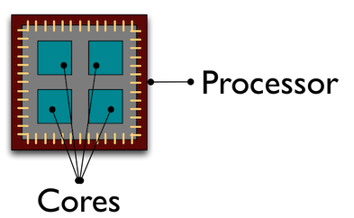

\tableofcontents
\clearpage

Here are the packages you will need in this chapter.
```{r, warning = FALSE, message = FALSE}
library(doParallel)
library(foreach)

library(AER)
library(dplyr)
```


# Parallel Computing

Up to now, we have seen R code run very quickly, especially vectorized functions. However, implementing more complex functions or using bigger data can result in code that does not run or takes an unreasonably long amount of time. 

## Computer Vocabulary

Some knowledge of the basics of how computers work is necessary to understand parallel computing. Every computer has a Central Processing Unit (CPU), also called processors. Modern computers tend to have more than one processor. Each processor has multiple cores. You can think of each core of each processor being able to handle one computation. Figure 1 from @jones_quick_2017 shows a stylized processor with 4 cores. 

```{r echo = FALSE, fig.cap = "Stylized CPU", fig.align = "center", out.width = "40%"} 

```


If you are a Mac user, type the following in Terminal to figure out how many processors and cores you have available. The first number is the number of processors. The second number is the total number of cores. My computer has 4 processors, each with 2 cores. This amounts to a total of 8 computations at one time being possible.
```{bash}
sysctl hw.physicalcpu  hw.ncpu
```

If you are a Windows user, open your Task Manager and select the Performance tab. This will show how many cores there are per processor. The number of "logical processors" is the number of processors times the number of cores per processor.

If you are a Linux user, type the following into your command line. The line "Core(s) per socket" will tell you the total number of cores you have. 
```{bash, eval = FALSE}
lscpu
```

Usually when you run code in RStudio, it only uses one processor. Parallel computing means that you are explicitly telling R to run code in parallel across more than one processor. 

## When is it appropriate to parallelize?

While it may be tempting to parallelize everything, this is not the most efficient approach. When running code in parallel, the computer copies the code to each processor prepares the processor to run the code. This itself is burdensome. If the code you are running in parallel is very simple, then the advantages of parallelism will be negated by the efficiency cost. 

Because each processor will run its own code, the tasks in the code need to be independent from one another. The term "embarrassingly parallel" means that it is easy to imagine your problem as several parallel tasks. These are the best candidates for parallel computing. No task depends on the result of another. 

### Practice Exercises 10.1
1. Recall that a grid search algorithm computes a result for all possible parameter combinations to then find the best parameters. Is this an embarrassingly parallel problem?
2. I want to calculate a function on all of the possible paths through a network. Is this an embarrassingly parallel problem?
3. I want to run my Mincer regression separately for each county in the U.S. (using different data than the built-in CPS data). Is this an embarrassingly parallel problem?
4. Looping through possible specifications, I want to change the covariates of my regression based on the outcome of the previous iteration. Is this an embarrassingly parallel problem?


## Non-Parallel Implementations

Bootstrapping is a good example of an embarrassingly parallel problem. First, let us implement bootstrapping without parallelism. Here is an implementation of the bootstrap with a for loop. First, we set up the data, set the seed, define the formula, and define the number of replications. Although we can get the point estimate in the loop, we can just save this to get it out of the way.
```{r}
# Setup 
set.seed(1024)
replications <- 100
data("CPS1985")
cps <- tibble(CPS1985)
mincer <- formula(log(wage) ~ education + experience + I(experience^2))

# Get point estimate
point <- lm(mincer, data = cps)
```

Here is the for-loop implementation. The \texttt{gcFirst} argument for \texttt{system.time()} indicates to do a garbage collection first. This allows for more comparable system times.
```{r}
# Bootstrap
for_results <- matrix(NA, 
                  nrow = replications, 
                  ncol = length(labels(terms(mincer))) + 1)

system.time(for (b in 1:replications) {

    bsamp <- cps %>%
        slice_sample(prop = 1, 
                     replace = TRUE)
    
    for_results[b, ] <- lm(mincer, data = bsamp) %>% 
        coefficients()
}, gcFirst = TRUE)

# Package results
for_results <- tibble(as.data.frame(for_results))
names(for_results) <- c("int", "edu", "exp", "exp2")
```

Before thinking about implementing parallelism, we can implement an apply-like function to see if it helps.
```{r}
bootstrap <- function(b, form, tib) {
    
    bsamp <- tib %>%
        slice_sample(prop = 1, 
                     replace = TRUE)
    
    lm(form, data = bsamp) %>% 
        coefficients() %>%
        return()
}

set.seed(1024)
system.time(
    lapply_results <- lapply(1:replications, bootstrap, form = mincer, tib = cps),
    gcFirst = TRUE)
```

## Parallel Implementations

There are several different packages and functions available for parallel implementation in R. 

### \texttt{mclapply}

The function \texttt{mclapply()} comes from the \texttt{parallel} package. The syntax and output is the same as \texttt{lapply}. There is a small detail that setting the seed is less straight-forward in parallel functions. A simple solution for \texttt{mclapply()} is to define the random number generator and then allow \texttt{mclapply()} to set the seed. Although this will not be identical to the above results, it will at least be reproducible. More information on this issue is available [here](https://irudnyts.github.io/setting-a-seed-in-r-when-using-parallel-simulation/). 
```{r}
RNGkind("L'Ecuyer-CMRG")
system.time(
    mclapply_results <- mclapply(1:replications, bootstrap, form = mincer, tib = cps, 
                                 mc.set.seed = TRUE),
    gcFirst = TRUE)
```

It is possible to explicitly set the number of cores.
```{r}
# Double check the number of cores
n_cores <- detectCores()

# Max out number of cores
system.time(
    mclapply_results <- mclapply(1:replications, bootstrap, form = mincer, tib = cps, 
                                 mc.set.seed = TRUE,
                                 mc.cores = n_cores),
    gcFirst = TRUE)
```

If you are going to be using \texttt{mclapply()} in your code, it is suggested NOT to use RStudio. This function may not be available for Windows operating systems. You can see if \texttt{parLapply()} will work instead.

### \texttt{foreach}

The packages \texttt{foreach} and \texttt{doParallel} allow for a parallel implementation of a for loop. The syntax is just a little different, and can actually be used for non-parallel implementation. 
```{r}
# These are the same, but the output is a little different
for (i in 1:3) {
    print(factorial(i))
}

foreach (i = 1:3) %do% {
    factorial(i)
}
```

To implement parllelism with \texttt{foreach}, it is necessary to setup the number of cores. The \texttt{doParallel} package allows for this.
```{r}
# Start the cluster
registerDoParallel(n_cores)

foreach (i = 1:3) %dopar% {
    factorial(i)
}

# Stop the cluster
stopImplicitCluster()
```

Note that the default output of \texttt{foreach} is a list. This makes it convenient to save the output without initializing an object to save results.
```{r}
# Start the cluster
registerDoParallel(n_cores)

out <- foreach (i = 1:3) %dopar% {
    factorial(i)
}

out
```

If you do not want a list, change the \texttt{.combine} argument.
```{r}
# Output a vector
foreach (i = 1:10, .combine = c) %dopar% {
    factorial(i)
}

# Output a matrix
foreach (i = 1:10, .combine = rbind) %dopar% {
    factorial(i)
}

foreach (i = 1:10, .combine = cbind) %dopar% {
    factorial(i)
}

foreach (i = 1:10, .combine = cbind) %dopar% {
    c(i, factorial(i))
}
```

Here is the \texttt{foreach} parallel implementation of our bootstrapping problem. Again note that setting the seed is a little more complicated.
```{r}
registerDoParallel(n_cores)
set.seed(1024, kind = "L'Ecuyer-CMRG")

system.time(foreach_results <- foreach (b = 1:replications, .combine = cbind) %dopar% {
 
    bsamp <- cps %>%
        slice_sample(prop = 1, 
                     replace = TRUE)
    
    lm(mincer, data = bsamp) %>% 
        coefficients()
}, gcFirst = TRUE)

stopImplicitCluster()
```

### Practice Exercises 10.2
1. Define a scalar to represent data collected on the number of heads from 100 coin flips with the below code. The likelihood with parameter \texttt{p} can be calculated directly with \texttt{dbinom}. Write a \texttt{foreach} loop in parallel that calculates the likelihood for a sequence of possible parameters between 0.2 and 0.7 spaced by 0.005. Outside of the loop, find the parameter value at which the likelihood is maximized. 
```{r, eval = FALSE}
# Create data
heads <- rbinom(1, 100, 0.5)

# Calculate likelihood of parameter p
dbinom(heads, 100, p)
```

# Further Reading

See [Roger D. Peng's book](https://bookdown.org/rdpeng/rprogdatascience/parallel-computation.html) for more background on parallel computing in R. 

## References

